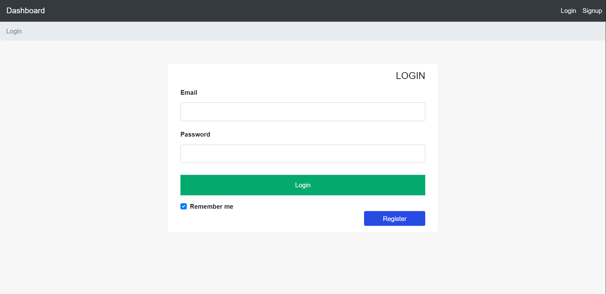
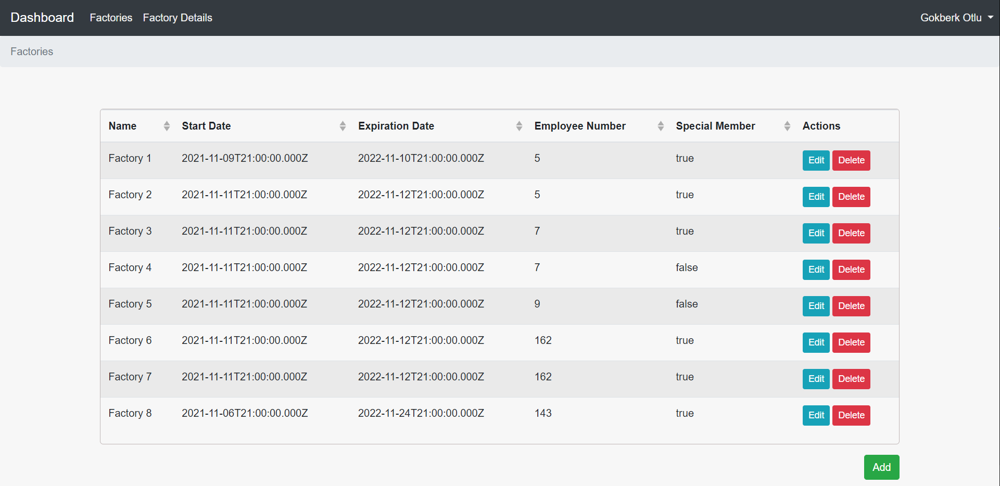
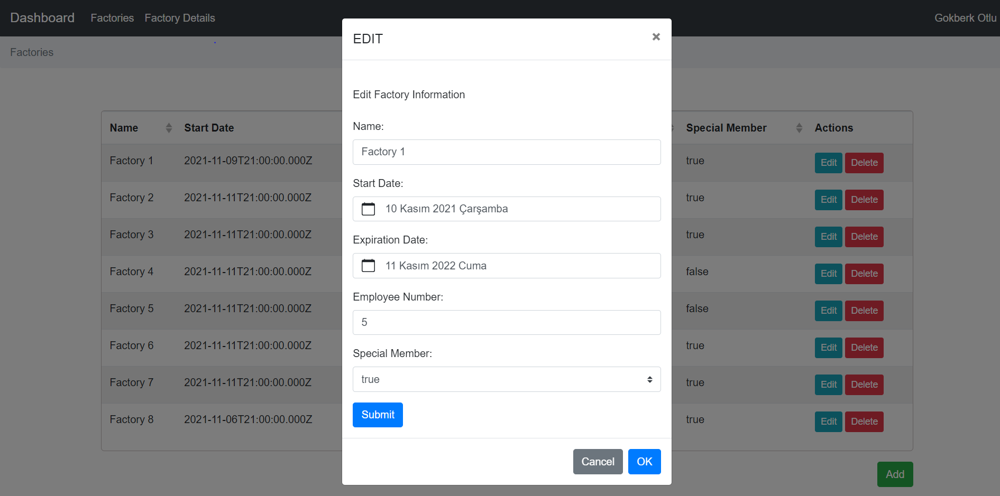
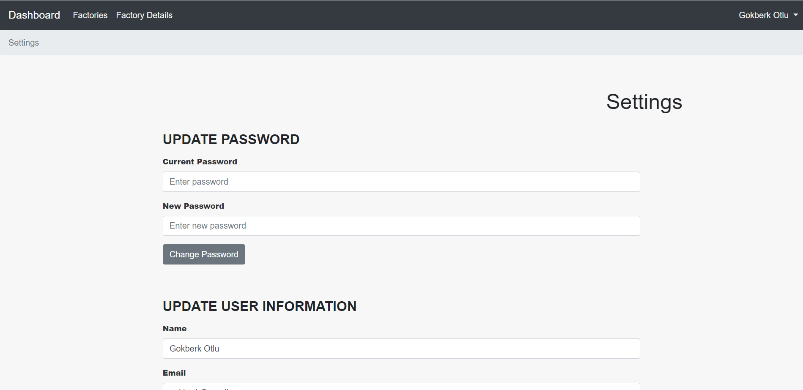

# 138 Reengen Fullstack Bootcamp | Final Project

# Factory Dashboard Application (VueJs & NodeJS)

## Content of Project

- Login operations are performed with redirects by using the token verification generated through the jwt library on the backend. User informations are kept on MongoDB database.

- Factory informations are stored in database via PostgreSQL. Factory informations can be viewed, deleted, added and edited via the interface. If the user does not have admin privileges, they can only view the table. Also factory energy uses are displayed in table on factory details page.

- Factory informations and energy usage can be edited with the changes in the database by communicating with the backend over the interface.

- User can edit informations such as username, e-mail, password.

### Build With

- HTML
- CSS
- [VueJs](https://vuejs.org/)
- [Vuex](https://vuex.vuejs.org/)
- [VueRouter](https://router.vuejs.org/)
- [Vuelidate](https://vuelidate.js.org/)
- [BootstrapVue](https://bootstrap-vue.org/)
- [NodeJs](https://nodejs.org/)
- [ExpressJs](https://expressjs.com/)
- [MongoDB](https://www.mongodb.com/)
- [PostgreSQL](https://www.postgresql.org/)
- [JWT](https://jwt.io/)